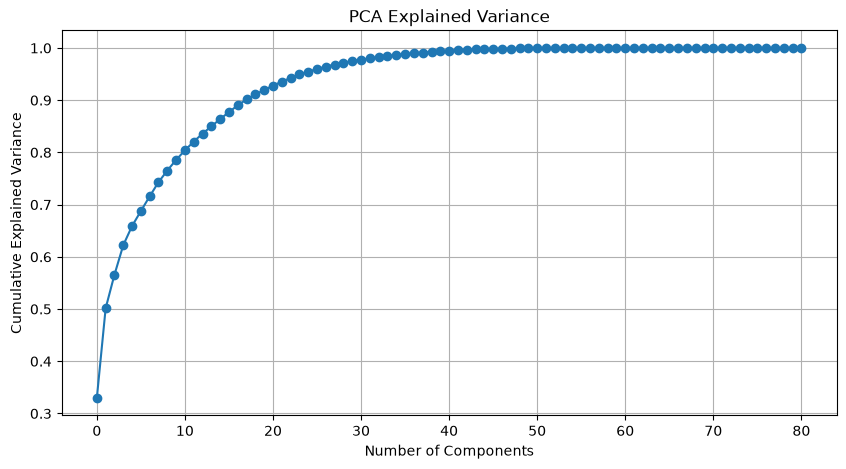
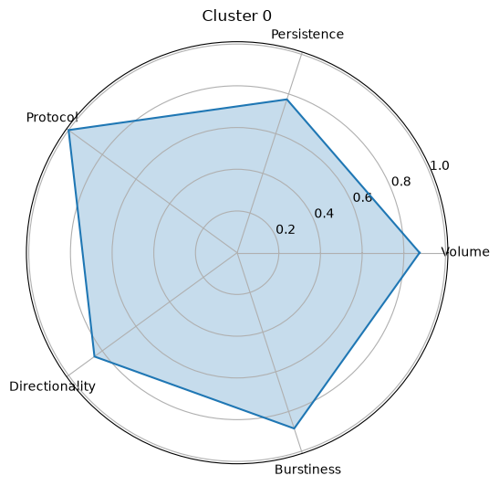
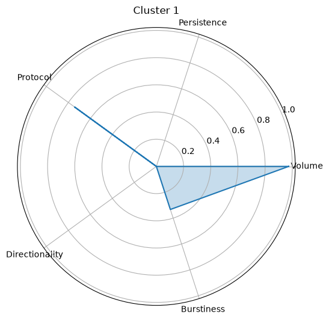
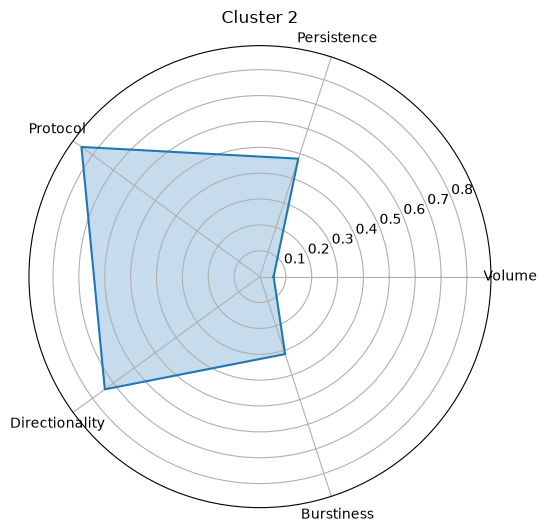
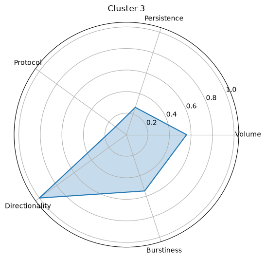
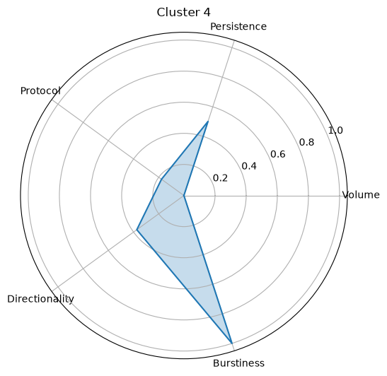
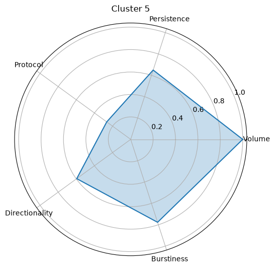
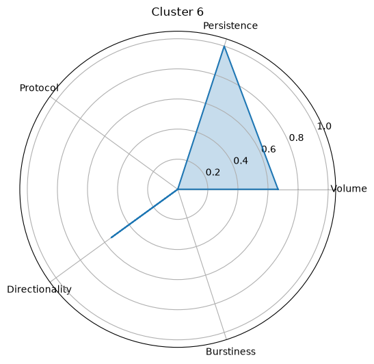
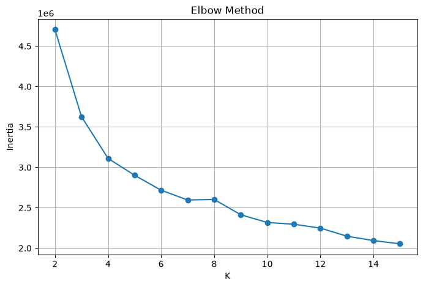

# Behavioral Characterization of Large-Scale Network Traffic using PCA and Clustering

## Overview

Modern networks generate millions of flows across a wide variety of applications and services. Traditional traffic analysis often relies on protocol labels, application signatures, or port numbers to understand network activity. However, these identifiers do not necessarily reflect how traffic behaves in practice.

This project investigates whether network traffic can be characterized through its behavioral patterns rather than application labels alone.

Using flow-level network statistics, the project applies exploratory data analysis, feature engineering, dimensionality reduction, and unsupervised learning to discover latent behavioral structures within network traffic.

---

## Research Question

**Can large-scale network traffic be more meaningfully characterized through behavioral patterns than through protocol labels alone?**

Rather than attempting to recover application identities, this project focuses on identifying behavioral traffic archetypes such as:

- Bulk data transfers
- Interactive communication
- Control-plane traffic
- Persistent sessions
- Idle connections

The objective is to understand how traffic behaves, not simply what application generated it.

---

## Dataset

### Dataset Characteristics

- Approximately **3.57 Million Network Flows**
- 82 Flow-Level Features
- 78 Application Protocol Categories

Example features include:

- Flow Duration
- Packet Counts
- Byte Counts
- Packet Length Statistics
- Inter-Arrival Times (IAT)
- TCP Flag Counts
- Active / Idle Time Metrics
- TCP Window Sizes

---

## Sampling Strategy

The complete dataset contains approximately **3.57 million network flows**.

Due to the computational cost of dimensionality reduction and clustering on the full dataset, a random sample of **100,000 flows** was selected for PCA and K-Means clustering.

The full dataset was used during exploratory analysis to understand:

- Protocol distribution
- Feature distributions
- Temporal characteristics
- Correlation structure

This sampling strategy provided a tractable dataset while preserving the dominant traffic behaviors present in the network.

---

## Project Pipeline

```text
Raw Network Flows
        │
        ▼
Exploratory Data Analysis
        │
        ▼
Feature Engineering
        │
        ▼
Logarithmic Transformation
        │
        ▼
Standardization
        │
        ▼
Principal Component Analysis
        │
        ▼
K-Means Clustering
        │
        ▼
Behavioral Traffic Profiling
```

---

## Exploratory Data Analysis

The EDA stage focused on understanding the statistical structure of the traffic.

### Protocol Distribution

The dataset exhibits a highly imbalanced protocol distribution, with a small number of applications accounting for a large fraction of observed traffic.

### Flow Duration Analysis

Flow duration exhibits strong heavy-tailed behavior:

- Large numbers of short-lived flows
- Persistent long-duration sessions
- Significant variance across applications

### Throughput Analysis

Metrics such as:

- Flow.Bytes.s
- Flow.Packets.s

display substantial skewness and outlier behavior.

### Correlation Analysis

Many network features exhibit strong correlation due to shared underlying traffic characteristics such as packet counts, byte counts, and session statistics.

These observations motivated subsequent preprocessing and dimensionality reduction.

---

## Feature Engineering

### Removing Non-Behavioral Identifiers

The following fields were removed before modeling:

- Flow.ID
- Source.IP
- Destination.IP
- Timestamp
- Label

These variables uniquely identify flows but do not describe traffic behavior.

---

### Infinite Value Audit

Certain network traffic metrics may theoretically contain infinite values when flow duration approaches zero.

An explicit audit was performed before preprocessing.

No infinite values were detected in the sampled dataset used for analysis.

---

### Skewness Analysis

Many network traffic features exhibit strong positive skewness.

Examples include:

- Flow Duration
- Throughput Metrics
- Packet Counts
- Inter-Arrival Times

Highly skewed features were identified using skewness statistics and transformed using:

```python
np.log1p(x)
```

This transformation:

- Compresses extreme outliers
- Preserves ordering
- Reduces variance imbalance
- Improves clustering stability

---

### Binary Feature Audit

TCP flag features represent binary or count-based network events rather than continuous measurements.

These variables were excluded from logarithmic transformation to preserve their original meaning.

---

### Special Handling of Window Size Features

The feature:

```text
Init_Win_bytes_backward
```

contains sentinel values representing unavailable measurements.

To avoid distortion during logarithmic transformation, this feature was excluded from the log-transform stage.

---

### Standardization

Features were standardized using:

```python
StandardScaler()
```

to ensure equal contribution during PCA and clustering.

All numerical features were transformed to:

```text
Mean = 0
Standard Deviation = 1
```

---

## Principal Component Analysis (PCA)

PCA was applied to reduce dimensionality and uncover latent behavioral factors within the traffic.

### Variance Retention

| Variance Retained | Components |
|------------------|------------|
| 90% | 18 |
| 95% | 25 |
| 99% | 39 |

The project retained:

```text
18 Principal Components
```

which preserve approximately:

```text
90% of total variance
```

while significantly reducing feature-space complexity.

---


## Interpretation Scope

Although 18 principal components were retained, only the first five were interpreted in detail.

The first five components captured the most dominant and interpretable dimensions of network traffic behavior.

Subsequent components explained progressively smaller amounts of variance and were primarily associated with more specialized effects such as:

- TCP flag combinations
- Protocol-specific characteristics
- Window-size behavior
- Fine-grained timing variations

These later components provide refinement of the dominant behavioral patterns rather than entirely new traffic dimensions.

---

## Principal Component Interpretation

### PC1 — Traffic Volume and Session Intensity

Dominant Features:

- Total Length of Packets
- Packet Counts
- Subflow Byte Statistics

Interpretation:

PC1 is primarily associated with the overall amount of data exchanged during a flow.

---

### PC2 — Session Persistence and Temporal Dynamics

Dominant Features:

- Flow Duration
- Idle Times
- Inter-Arrival Time Variability

Interpretation:

PC2 captures long-lived sessions and temporal communication behavior.

---

### PC3 — Protocol and Connection Semantics

Dominant Features:

- Source/Destination Ports
- TCP Flags
- Packet Length Characteristics

Interpretation:

PC3 reflects protocol-specific communication characteristics.

---

### PC4 — Flow Directionality

Dominant Features:

- Forward Packet Statistics
- Backward Packet Statistics

Interpretation:

PC4 differentiates flows based on the balance of forward and backward communication.

---

### PC5 — Burstiness and Packet Timing

Dominant Features:

- Minimum Inter-Arrival Times
- Small Packet Behavior
- Segment Characteristics

Interpretation:

PC5 captures short-term burst communication patterns.

---

## Clustering

K-Means clustering was applied to the PCA-transformed feature space.

The objective was not to recover protocol labels but to identify groups of flows exhibiting similar behavioral characteristics.

---

## Cluster Interpretation Methodology

Clusters were interpreted using three complementary sources of evidence:

1. Median feature values
2. Protocol distributions within each cluster
3. Average principal component scores

Cluster names represent behavioral interpretations rather than ground-truth categories.

---

## Behavioral Traffic Archetypes

### Cluster 0 — Persistent High-Volume Sessions

Characteristics:

- High traffic volume
- Long-lived communication
- Strong protocol identity

Represents sustained high-volume data exchange.


---

### Cluster 1 — Bulk Transfer Traffic

Characteristics:

- High throughput
- Large packet sizes
- Relatively short sessions

Represents concentrated data-transfer activity.


---

### Cluster 2 — Micro-Transaction Traffic

Characteristics:

- Very short duration
- Minimal payload volume
- Small packet counts

Represents lightweight communication events.


---

### Cluster 3 — Interactive Application Traffic

Characteristics:

- Moderate traffic volume
- Bidirectional communication
- Typical user-driven activity

Represents ordinary application interaction patterns.


---

### Cluster 4 — Control / Acknowledgement Traffic

Characteristics:

- Minimal payload transfer
- ACK-dominated behavior
- Very small packets

Represents connection-management traffic rather than data exchange.


---

### Cluster 5 — Persistent Data Sessions

Characteristics:

- Long duration
- Continuous payload exchange
- High traffic volume

Represents stable long-lived communication sessions.


---

### Cluster 6 — Idle Persistent Connections

Characteristics:

- Extremely long duration
- Low throughput
- Stable timing patterns

Represents active but lightly utilized connections.


---

## Cluster Validation

### Elbow Method

The Elbow Method was initially used to evaluate clustering compactness across multiple values of K.



---

### Silhouette Analysis

Silhouette scores were computed for values of K ranging from 2 to 10.

| K | Silhouette Score |
|---|---:|
| 2 | 0.292 |
| 3 | 0.336 |
| 4 | 0.329 |
| 5 | 0.290 |
| 6 | 0.288 |
| 7 | 0.290 |
| 8 | 0.286 |
| 9 | 0.233 |
| 10 | 0.233 |

The highest silhouette score was observed at **K = 3**.

However, K = 3 produced broad traffic categories that obscured several behaviorally distinct communication patterns.

K = 7 was selected because it provided richer behavioral segmentation while maintaining a comparable silhouette score.

This reflects the trade-off between maximizing cluster separation and obtaining interpretable traffic archetypes.

---

## Key Findings

1. Network traffic naturally organizes into behavioral groups.

2. Protocol labels alone do not fully explain traffic behavior.

3. Five dominant behavioral dimensions were identified:

   - Traffic Volume
   - Session Persistence
   - Protocol Semantics
   - Directionality
   - Burstiness

4. Multiple protocols frequently appear across several behavioral clusters.

5. Behavioral characterization provides a richer representation of network activity than application labels alone.

---

## Applications

### Network Monitoring

Summarize millions of network flows into a small number of behavioral categories.

### Traffic Engineering

Identify:

- Bulk transfers
- Interactive traffic
- Persistent sessions

for improved resource allocation.

### Security Analytics

Use behavioral clusters as a baseline for anomaly detection and traffic profiling.

### Encrypted Traffic Characterization

Analyze communication behavior without requiring packet payload inspection.

---

## Limitations

- PCA and clustering were performed on a 100,000-flow sample rather than the complete dataset.
- Cluster labels are behavioral interpretations and not ground-truth categories.
- K-Means assumes approximately spherical clusters and may not capture all traffic structures.
- Behavioral patterns may evolve over time as network usage changes.

---

## Future Work

Potential extensions include:

- Isolation Forest Based Anomaly Detection
- Cluster Stability Analysis
- Real-Time Traffic Classification
- Automated Traffic Policy Recommendation Systems
- Behavioral Drift Detection

---

## Technologies Used

- Python
- Pandas
- NumPy
- Matplotlib
- Seaborn
- Scikit-Learn
- Jupyter Notebook

---

## Author
K. Aakanksh Reddy
ECE Undergraduate, IIT Kharagpur

Areas of Interest:

- Signal Processing
- Machine Learning
- Network Analytics
- Data Science
